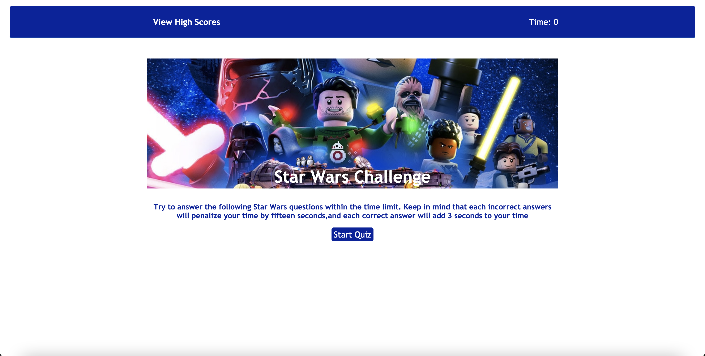

# Code Quiz

Timed quiz on JavaScript of Star Wars.

## Description

This is a timed quiz!!! Test your knowledge of Star Wars in a race against the clock.

Here's how it works:
* Click the "Start Quiz" button to begin
    * A timer will start in the upper right corner and you will be met with your first questions
    * The questions will not be prompts, but will be dynamically updated content through the DOM. 
* Each question will be multiple choice! 
* When you click on the correct answer, there is text on the screen informing as such and the question moves on to the next one and adding 3 secongs to your remaining time.
* When you click on the incorrect answer, there is text on the screen informing as such, 15 seconds will deducted to your remaining time.
* The quiz ends when either:
    * The timer hits 0
    * You answer all of the questions available
* After the quiz, you are presented with you score.
    * You may enter your initials for your score. 
    * The score is saved in the localStorage 
    * You then see the high scores pulled from localStorage
* On the initial landing page; there is a link to view the high scores saved in the localStorage.

## Mock-Up

## Link to Deployed Application

https://jorgeebn16.github.io/4-Web-APIs-Challenge/

## Contributions
Made with ❤️ by Jorge Navarro

## Checklist of Completion
- [x] All above features are included
- [x] Application is deployed to live URL
- [x] Application loads with no errors
- [x] GitHub repository contains application code
- [x] Application user experience is intuitive and easy to navigate
- [x] Application user interface style is clean and polished
- [x] Repository is uniquely named
- [x] Repository follows best practices for file structure and naming conventions
- [x] Repository follows best practices for class/id naming conventions, indentation, quality comments, etc.
- [x] Repository contains multiple descriptive commit messages
- [x] Repository contains quality README file with description, screenshot, and link to deployed application